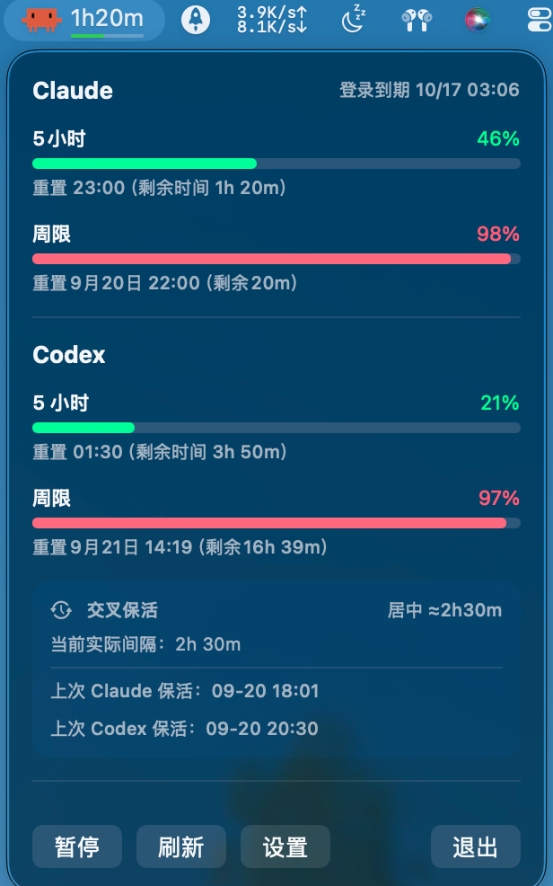
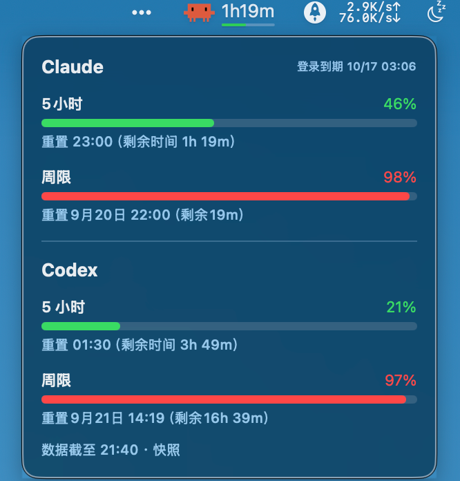
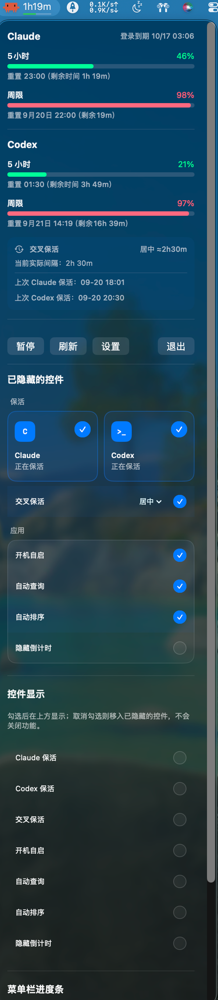

<div align="center">

# 🕒 KeepAliveBar

**一个 macOS 菜单栏工具：菜单栏直接看到 Claude Code / Codex 的剩余额度，并在 5 小时窗口关闭的那一刻自动续上。**

*坐到电脑前不再从零开始算 5 小时——窗口早已开着，剩多少额度一眼就能看到。*

[English](README.md) · **简体中文**


</div>

---

## 这是什么

Claude Code 和 Codex 的订阅都按 **5 小时窗口**计费：窗口从你发出的**第一条**消息开始算，五小时后关闭——中间你用没用完全不影响。晚上离开电脑，22:00 回来随手问一句，一个崭新的 5 小时窗口就这样被一个十分钟的小任务烧掉了。

**KeepAliveBar** 在菜单栏里同时解决这两件事：

- 它盯着**服务端自己的重置时间戳**，窗口一关就立刻发一条极小的消息开启下一个窗口。你睡觉时窗口一直在滚动，等你回来时接手的是一个已经走了几小时的窗口，而不是刚被你开出来的新窗口。
- 它把**剩余额度放进菜单栏**。不用 `/usage`、不用猜：Claude 和 Codex 的 5 小时与周用量、准确重置时间，一眼可见。
- **交叉保活**让你决定两侧窗口起点相隔多远，最多 **2.5 小时**（正好反相）。无论你先拿起哪一个工具，它的窗口都已经开着并且走到了中途。

那条保活消息是用你现有订阅凭据发出的**直连 HTTP 推理请求**：Claude **8 tokens**，Codex 约 30 tokens——而不是完整 `claude -p` / `codex exec` 往返的 22,698 / 13,871。

## ✨ 功能

- 📊 **菜单栏看额度** —— 实时显示 Claude 距下次 5 小时重置的倒计时和用量条，也可以只留图标保持安静。
- 🖱️ **悬停快照** —— 鼠标停在图标上 **0.8 秒**，正下方浮出一张只读卡片：Claude + Codex 的 5 小时与周用量。**不发任何请求**，只画当前内存里的数据，底部一行标明数据截至时刻；鼠标移开即消失，也不吃点击。
- 🎯 **服务端真值** —— 读的是官方客户端用的同一批端点（Claude `/api/oauth/usage`、Codex `/backend-api/wham/usage`）。不盲猜 5 小时间隔，也不像 `ccusage` 那样把首条消息向下取整到整点（误差可达约 1 小时）。
- 🪶 **8 token 保活** —— 直连 `POST /v1/messages` 而不是走 CLI 往返，开窗那条消息对周限额几乎零消耗。
- ✅ **自证成功** —— 每次发完都会轮询回读 usage，直到新窗口真的出现。没开出来就**明确报错**并按原节奏重试。它**刻意不自动降级到 CLI**：否则直连哪天失效，CLI 会悄悄补上，表面一切正常，实际早已退回每次 22,698 tokens 且无人察觉。
- ↔️ **交叉保活** —— 让两侧窗口按你设定的阈值错开（30–145 分钟，5 分钟一档），或选 **居中**，让两侧起点稳定相隔约 **150 分钟**，正好是两个 5 小时周期的中点。后到期的一侧会等待，而不是提前开火。
- 🔀 **两侧独立开关** —— `Claude 保活` 与 `Codex 保活` 互不影响，可只开一侧。
- ⏱️ **临近到期收紧轮询** —— Codex 的窗口从**消息时刻**起算，晚一秒就真少一秒，所以窗口到点时轮询从 5 分钟收紧到 **20 秒**，把每轮损耗从平均 ~2.5 分钟压到 ~10 秒，开火成功后恢复。Claude 按半点对齐，早发晚发不亏，无需着急。
- 🛡️ **周限闸门** —— 周额度用尽时停止保活，而不是每 3 分钟撞一次墙刷错误日志；越过周重置时刻自动解除。被拦住时弹窗顶部有一行说明，不至于以为保活坏了。
- 🔑 **登录到期提醒** —— 显示钥匙串里的 `refreshTokenExpiresAt`，提前 3 天提醒，菜单栏同时显示 `⚠︎`（即使隐藏倒计时或暂停保活也保留），避免登录悄悄过期后一切静默停摆。
- 🎛️ **菜单栏可自定义** —— 控件可隐藏/恢复，Claude / Codex 卡片支持自动或手动排序，菜单栏用量条的填充色与底色深度（0–100% 不透明度）可调，重启后继续生效。
- 🤖 **也有纯后台模式** —— 不想要界面的话，同一套逻辑可以作为 launchd 代理运行（`keepalive.sh`），无状态轮询、睡眠/重启后自愈，并附带只读面板 `status.sh`。

## 📸 截图

| 弹窗 · 用量与保活 | 悬停快照（不发任何请求） |
|:---:|:---:|
|  |  |

菜单栏本身显示距下次重置的倒计时（`1h20m`）和下方的用量条。弹窗自上而下是 Claude 与 Codex 的 5 小时 / 周用量百分比、准确重置时刻、剩余时间和 Claude 登录期限，再往下是交叉保活摘要：设定目标（`居中 ≈2h30m`）、当前实际间隔（`2h 30m`）和两侧上次保活时间。

<div align="center">
  
</div>

「设置」在首页下方就地展开：已隐藏的控件仍然生效、可随时勾回原位，每个控件都能单独显隐，菜单栏进度条的配色也可调。

## 🚀 安装

### 方式一 · 菜单栏 App（推荐）

```bash
git clone https://github.com/ddasy/KeepAlive.git
cd KeepAlive
bash install-app.sh
```

`install-app.sh` 会编译、安装到 `/Applications/KeepAliveBar.app`、生成保活专用的 `claude` 固定副本（身份不随 CLI 每日自动更新变化，让钥匙串「始终允许」长期有效），并注册开机自启登录项。菜单栏立刻出现 Clawd 图标。

只编译安装、不要登录项：

```bash
bash build-app.sh
```

构建在临时目录里组包，编译和签名都成功后才整包替换 `/Applications/KeepAliveBar.app`——编译失败不会碰你正在用的那份，且**磁盘上只会存在一份 `.app`**（两份会在聚焦搜索里并排出现，误点就会跑出第二个实例：两个都保活、共用同一份 UserDefaults 和日志）。

想编译到别处试跑：`KA_DEST=/tmp/ka/KeepAliveBar.app bash build-app.sh`。
只验证构建、不安装：`KA_VERIFY_ONLY=1 bash build-app.sh`。

### 方式二 · 纯后台 launchd 脚本

```bash
bash status.sh      # 只读：打印当前用量与重置时间，不发任何消息
bash install.sh     # 启用 24/7 后台保活
bash uninstall.sh   # 停用
```

> 两种方式**二选一**，别同时开——否则两个调度器会往同一个账号里开火。

## 🖱️ 使用

点击菜单栏图标：

| 区域 | 内容 |
|---|---|
| **用量** | Claude 与 Codex 的 5 小时 / 周用量、重置时间、Claude 登录期限。纯展示，无副作用 |
| **Claude 保活** | Claude 5h 窗口关闭后是否自动续窗（独立开关） |
| **Codex 保活** | Codex 5h 窗口到期后是否自动续窗（独立开关） |
| **交叉保活** | 在「设置 → 保活」中设置两侧周期起点的最小间隔（默认 120 分钟），或选 **居中**（约相隔 150 分钟） |
| **保活记录** | 两侧上次保活时间与结果，以及暂停 / 周限 / 进行中状态 |
| **开机自启** | 用 `SMAppService` 注册登录项 |
| **自动查询** | 打开弹窗时是否自动查一次用量 |
| **隐藏倒计时** | 菜单栏只留图标（暂停时仍显示 `⏸`，否则会忘了自己按过暂停） |
| **设置** | 在首页原有内容下方就地展开：控件显隐、排序、菜单栏进度条配色 |
| **刷新 / 退出** | |

> 开机自启的登录项绑定 App 当前所在路径，所以**建议先 `bash install-app.sh` 把 App 放到 `/Applications`，再勾开机自启**，位置才稳定。勾选后会跳转「系统设置 ▸ 通用 ▸ 登录项」让你确认（普通 App 登录项是秒开、无需密码的）。

### 交叉保活，具体来说

两个 5 小时周期稳定错开时，相邻起点的间隔之和恒为 5 小时——所以最远只能相隔 **2.5 小时**，这正是 **居中** 模式的目标。

例如 Claude 13:00 开始新周期、Codex 14:00 到期，阈值 120 分钟时，Codex 等到 15:00 之后再触发。目的只有一个：无论你什么时候坐下来，都不会有一侧刚好塞给你一个为小任务而开的崭新 5 小时窗口。

- 先到期的一侧按原有到期缓冲续窗；后到期的一侧若与对方周期起点相隔不超过阈值，就延后。严格大于阈值才放行：相等时仍等待，越过边界后由现有调度触发（保留到期缓冲、轮询和失败退避）。
- **居中**时，到期一侧以对方最新窗口起点之后 150 分钟为目标：Codex 精确等待到该时刻，Claude 按 `windowEnd` 推导的半小时网格取最近点（正好半格取较早点）。目标网格已过去时立即触发。
- 从任意初始错开量出发，居中最多各等待一次；随后两侧不会每轮重复等待，实际间隔保持在约 150 分钟附近（Claude 受网格影响约 ±15 分钟，Codex 无网格偏差）。
- 以已确认的重置时间减去 5 小时推算周期起点，没有可用真值时才参考成功保活时间；失败尝试不推进周期。
- 等待期间显示「Claude / Codex 交叉等待至…」；Claude 等待时菜单栏显示 `↔` 和等待倒计时。
- 每 5 分钟重查两侧用量，识别手动使用引起的新窗口，发送前再次检查间隔。睡眠恢复后两侧都到期时，优先处理较早到期的一侧（同刻或时间未知时 Claude 优先），发送串行执行。
- 暂停、单侧关闭、周额度限制及失败退避继续生效。交叉模式跳过首次同时发送两侧消息的授权预热。设置与周期依据会持久化，旧安装默认保持关闭。

此功能控制的是 **App 的自动触发时机**：用户手动发消息和服务端窗口对齐规则仍可能改变实际重置间隔，App 会根据之后查到的真实窗口重新计算，不能保证平台侧重置时间每次都精确满足阈值。纯后台 `keepalive.sh` 仍采用原调度，不读取此 App 设置。

## ⚙️ 它凭什么「精确」

整个设计只有一个核心：**问服务端，别猜。**

```
GET https://api.anthropic.com/api/oauth/usage
Authorization: Bearer <macOS 钥匙串 "Claude Code-credentials" 里的 OAuth token>
anthropic-beta: oauth-2025-04-20
```

响应里的 `five_hour.resets_at` 就是当前 5 小时窗口的**真实重置时刻**。逻辑：轮询该字段 → 一旦越过重置时刻（窗口已关）→ 发一条极小的保活消息 → 开启新窗口 → 循环。

| 环节 | 实现 |
|---|---|
| Claude 用量 | `GET /api/oauth/usage`（Claude Code 的 `/usage` 用的同一个端点） |
| Codex 用量 | `GET /backend-api/wham/usage`（服务端真值，免费）；不可达时才退回扫 rollout 日志 |
| Claude 保活 | `POST /v1/messages` —— **8** tokens in / 1 out |
| Codex 保活 | `POST /backend-api/codex/responses` —— 约 14 in / 16 out |
| 凭据 | CLI 已经存好的同一份订阅 OAuth 凭据；发送前 `unset ANTHROPIC_API_KEY`，确保走订阅而非 API 账单 |
| 自证 | 每次发完轮询回读 usage 直到新窗口出现（实测 Claude 约需 70 秒，只等几秒会稳定误报「没开出窗口」） |
| 后台模式 | launchd `StartInterval=300`，无状态轮询，睡眠/重启后自愈 |

**为什么只要 8 个 token：** 保活需要的只是**一条计费到订阅的推理请求**。`claude -p` / `codex exec` 会额外背上工具定义、系统提示词、全局 `CLAUDE.md`/`AGENTS.md`、skills 清单——这些对「开窗」没有任何贡献，却占了 99.9% 的 token。（Claude 那 141KB 请求体里，29 个工具定义就占 97KB。）

| | 旧写法（CLI） | 现在（直连 HTTP） |
|---|---|---|
| Claude | `claude -p 'Reply OK' --model haiku` → **22,698** in / 51 out | `POST /v1/messages` → **8** in / 1 out |
| Codex | `codex exec 'Reply OK'` → **13,871** in / 16 out | `POST /backend-api/codex/responses` → **14** in / 16 out |

*（2026-09-06 同机同账号实测。）*

**两侧都已实证直连确实能开窗：**

- Codex：5h 窗口关闭后 `reset_at` 会随时间滚动（= 未锚定）；发出一条 30 token 的裸 HTTP 请求后，它立刻固定在「请求时刻 + 5h」不再变化 —— 新窗口已开。
- Claude：2026-09-07 03:29:59 窗口关闭，03:31:36 直连发出 8 token 请求，`five_hour.resets_at` 从 `null` 变为 `08:30:00`（= 旧窗口末尾 + 5h，Claude 的窗口按半点对齐，不是从消息时刻起算）。

**刻意不做自动降级。** 否则直连哪天失效了，CLI 会把它悄悄补上，表面一切正常，实际早已退回每次 22,698 tokens。宁可吵，也不要「看起来正常」。要手动退回旧写法：`KA_CLAUDE_DIRECT=0` / `KA_CODEX_DIRECT=0`（App 侧 `defaults write com.iu.keepalivebar directFire -bool false`）。这是显式开关，不是自动降级。

> ⚠️ 附带影响：Codex 的登录态由 CLI 维护。既然不再自动回落 CLI，token 过期后直连会一直 401、不会被自动刷新——跑一次 `codex` 或重新登录即可。日志里会写清楚。

CLI 路径（手动切回时）仍在独立的系统临时空目录中运行，命令结束后立即删除该目录，因此没有文件、`CLAUDE.md` 或 git 上下文可被读取或遗留；Claude 用 `--model haiku`、`--strict-mcp-config`，并清除 `ANTHROPIC_API_KEY`。

## 🔧 配置（后台模式环境变量）

可写进 plist 的 `EnvironmentVariables`：

| 变量 | 默认 | 说明 |
|---|---|---|
| `KA_CLAUDE_DIRECT` | `1` | 1=直连 `POST /v1/messages` 保活（8 tokens）；0=手动退回 `claude -p`（22,698 tokens）。失败时不会自动降级 |
| `KA_CODEX_DIRECT` | `1` | 1=直连 `POST .../codex/responses`（30 tokens）；0=手动退回 `codex exec`（13,871 tokens） |
| `KA_API_MODEL` | `claude-haiku-4-5-20251001` | 直连用的完整 model id（CLI 收别名，HTTP 不收） |
| `KA_MODEL` | `haiku` | 切回 CLI 写法时用的模型（最省周限额） |
| `KA_BUFFER_SEC` | `90` | 真实重置时刻之后再等多少秒才发（确保旧窗口彻底关闭） |
| `KA_MIN_REFIRE_SEC` | `17400` | 防抖：两次保活最小间隔（4h50m） |
| `KA_WEEKLY_GUARD_PCT` | `101` | 周用量≥此百分比时暂停保活（默认永不触发；设 90 可省额度） |
| `KA_CODEX_BIN` | 自动查找 | Codex CLI 路径 |
| `KA_CODEX_MODEL` | `gpt-5.6-luna` | Codex 保活模型 |
| `KA_CODEX_EFFORT` | `low` | Codex reasoning effort |
| `KA_CODEX_PROMPT` | `Reply OK` | Codex 保活消息，建议保持原样 |
| `KA_CODEX_FALLBACK_SEC` | `18000` | 没有 Codex reset 快照时，等待 5 小时再首次激活 |
| `KA_CODEX_MIN_REFIRE_SEC` | `17400` | Codex 两次激活最小间隔（4h50m） |
| 轮询频率 | plist `StartInterval=300` | 调小 → 窗口衔接更紧密，但请求更频繁 |

## 📋 环境要求

- macOS 13 (Ventura) 或更高，Apple Silicon
- Xcode Command Line Tools（`xcode-select --install`）
- Claude Code 和 / 或 Codex CLI，且**已用订阅账号登录**（读取的就是钥匙串里的这份 OAuth 凭据）

## ⚠️ 重要前提与风险（务必了解）

1. **依赖一项「被暂停」的计费政策。** Anthropic 曾计划从 2026-06-15 起把 `claude -p` / Agent SDK / headless 用量从订阅的 5 小时+周限额里**拆出去**、改走单独的每月额度。若那样，该路径就**不再重置交互窗口**，本方案失效。该改动已于 6-15 被官方**暂停**，目前仍计入订阅限额——但官方明说会重推，届时需重新评估（可用 `bash status.sh` 观察保活后 `resets_at` 是否真的跳动来判断是否仍生效）。
2. **保活只优化「5 小时窗口不浪费」，不增加周总量。** 你的周限额是硬上限；保活消息本身用量≈0，对周限额几乎无消耗，但也帮不了你突破周上限。
3. **必须走订阅认证。** 脚本已在发消息前 `unset ANTHROPIC_API_KEY`，避免误走 API 计费。若你机器上强制用 API key，则保活会计入 API 账单而非订阅窗口。
4. **这是对个人订阅的自动化「保温」，属灰色地带。** 仅用于你自己的账号；Anthropic 未来的政策调整可能限制此类用法。请自行判断是否符合你的使用条款。

## 🧪 开发

```bash
# 策略、展示、状态调度与设置隔离测试：直接编译生产源文件，
# 不联网、不发推理请求、使用独立偏好设置
bash tests/run-cross-keepalive.sh

# 编译优化版本、组装资源、签名并验证；不退出旧实例、不安装
KA_VERIFY_ONLY=1 bash build-app.sh
```

模块职责、状态约束与新功能放置规则见 [docs/ARCHITECTURE.md](docs/ARCHITECTURE.md)。

| 文件 | 作用 |
|---|---|
| `Sources/KeepAliveBar/` | 菜单栏 App，按状态、策略、平台实现、展示和界面分目录 |
| `scripts/swift-sources.sh` | 构建与测试共用的 Swift 源文件清单 |
| `build-app.sh` | 编译 → 临时目录组包 → 整包替换 `/Applications/KeepAliveBar.app` 并重启 |
| `install-app.sh` | `build-app.sh` + 保活专用 `keepalive-claude` 固定副本 + 开机自启登录项（自动去重） |
| `keepalive.sh` | launchd 版核心：查 Claude usage / Codex 快照 → 判断 → 必要时发保活 |
| `status.sh` | **只读**面板：打印 Claude/Codex 用量、重置时间和自动激活状态，随时可跑，不发消息 |
| `com.iu.claude-keepalive.plist` | launchd LaunchAgent 模板 |
| `install.sh` / `uninstall.sh` | 启用 / 停用 launchd 后台服务 |
| `keepalive.log` / `state.json` | launchd 版的日志与状态 |

App 的日志在 `~/Library/Application Support/KeepAliveBar/`。

## ❓ 常见问题

**Q：怎么验证它真的「开了新窗口」？**
A：在一段闲置（窗口关闭）之后，观察 `keepalive.log` 出现 `🔔 FIRED`，然后立刻 `bash status.sh` —— 5 小时窗口的「重置」时间应跳到约 5 小时之后、用量从高位回落。

**Q：会不会把数据发给第三方？**
A：不会。它只用你自己的凭据访问 Anthropic 和 OpenAI 自家的端点，没有任何统计上报。

**Q：会读我的代码或对话吗？**
A：不会。保活是一条裸 HTTP 请求，提示词固定为两个单词；即使手动切回 CLI，也在随后立即删除的空临时目录里运行。

**Q：App 和 launchd 脚本能一起开吗？**
A：别。二选一——同时开意味着两个调度器往同一个账号里开火。

## 🔎 关键词

面向 **Claude Code** 与 **Codex** 订阅的 macOS **菜单栏**工具：一眼看到**剩余额度**和 **5 小时窗口**重置时间，用一条 8 token 的请求自动**续窗**，并通过**交叉保活**错开两侧窗口——坐到电脑前再也不用从头开始算 5 小时。
